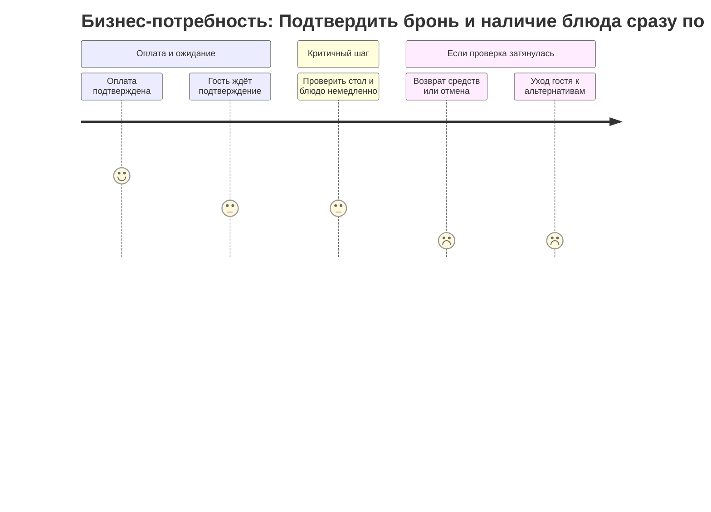
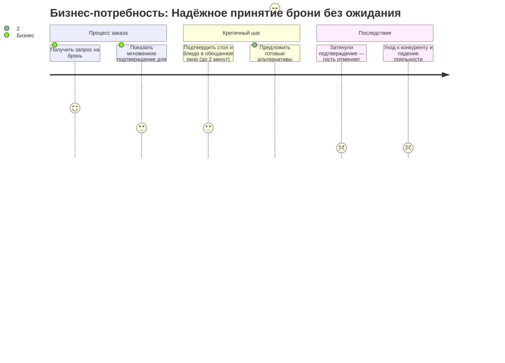
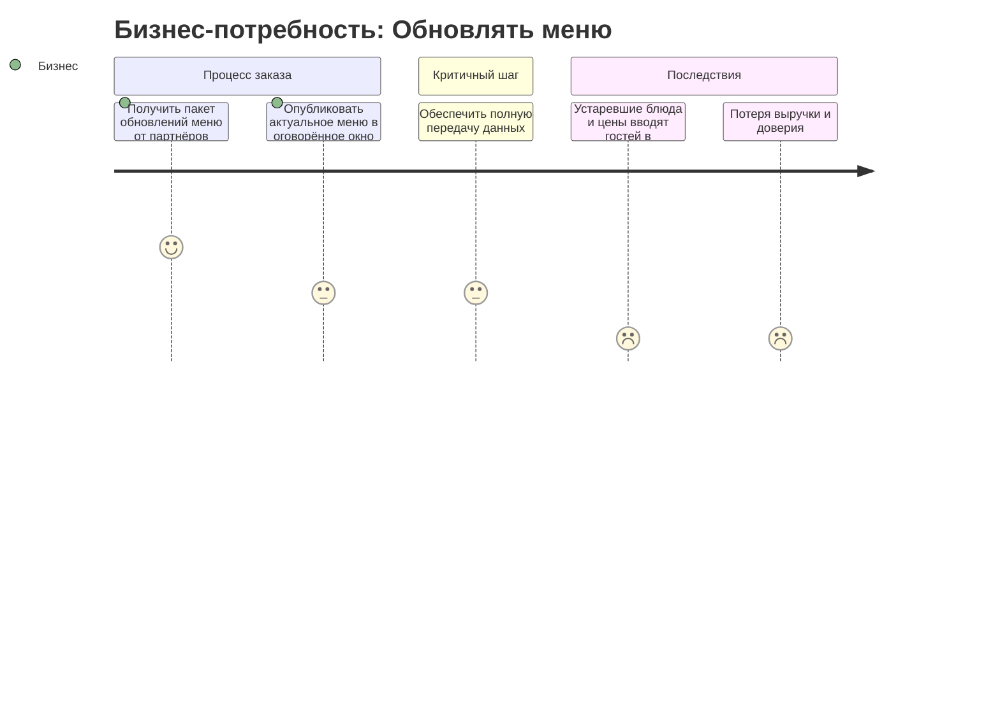
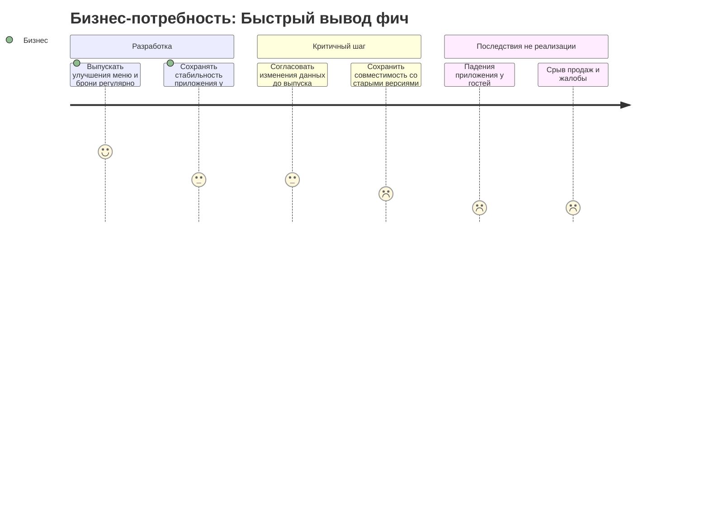
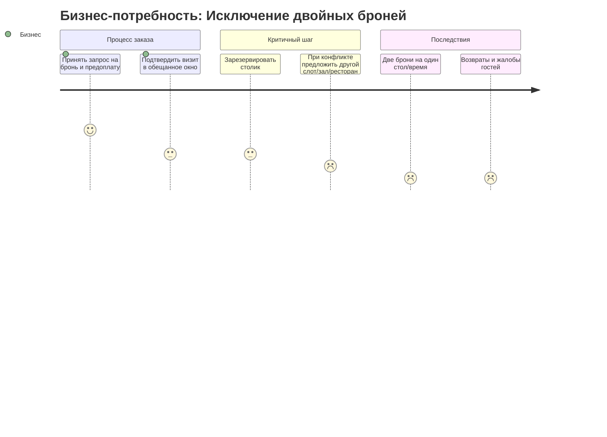
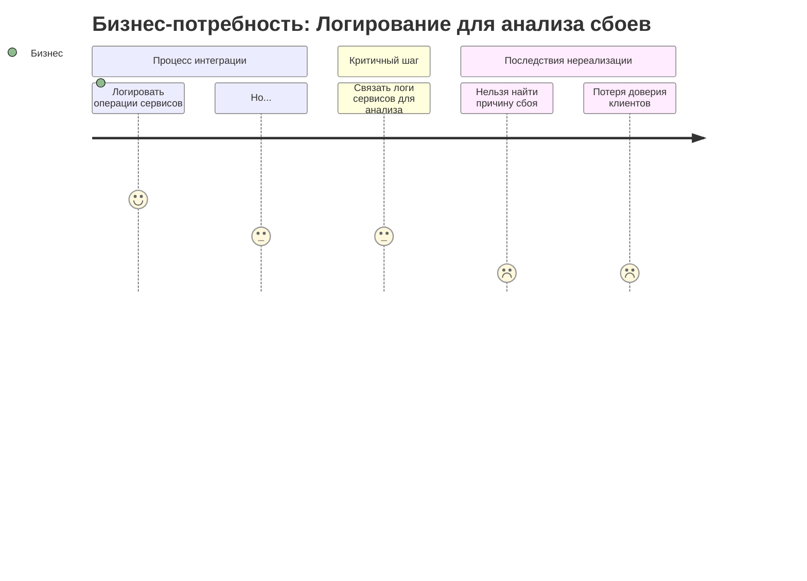
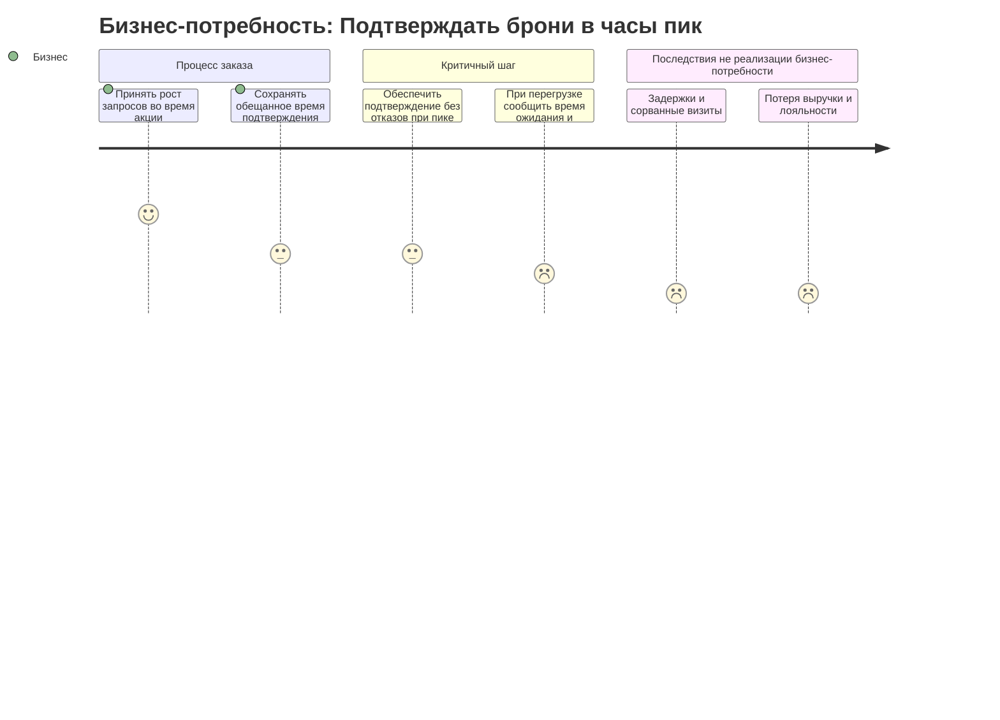
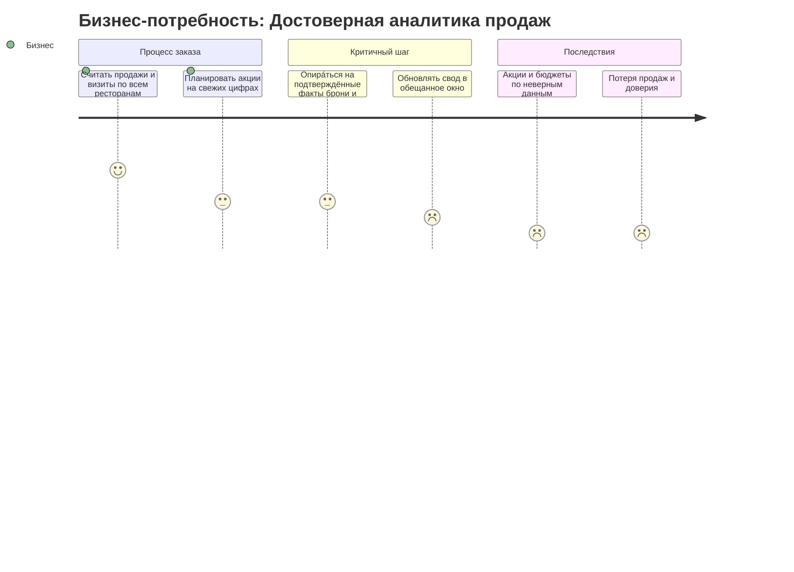
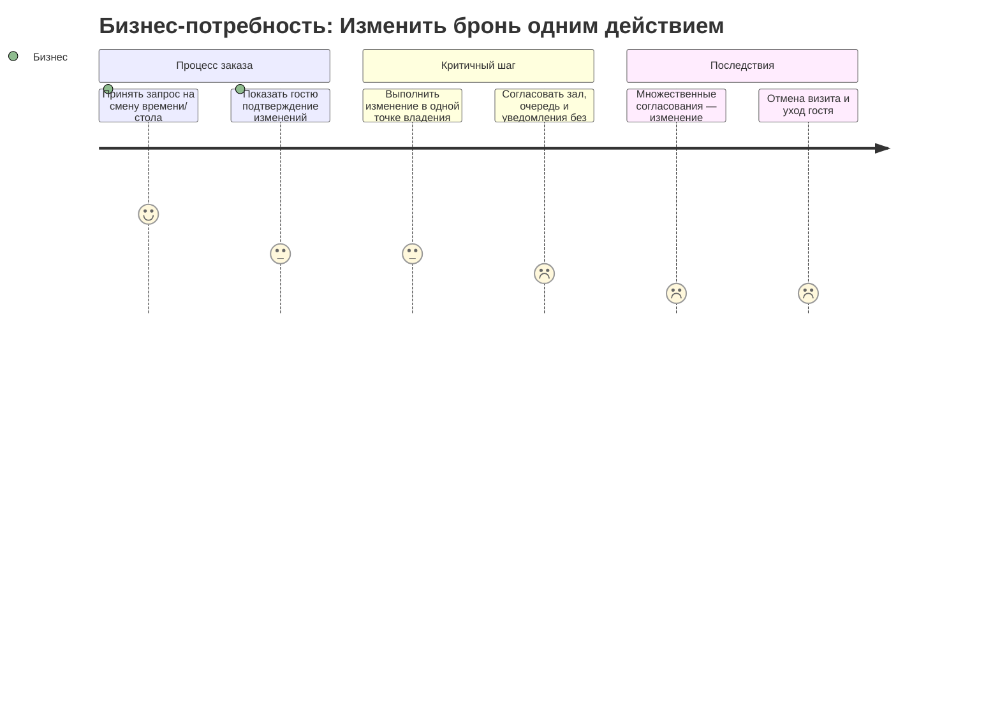
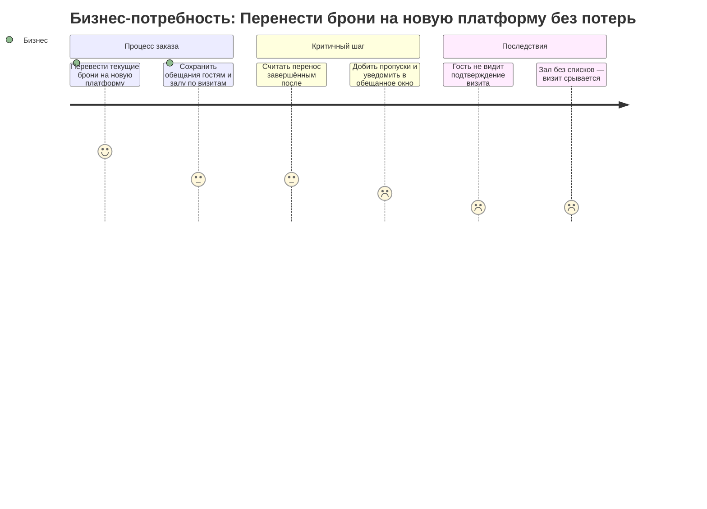

**Презентация: "Ловушки очевидных решений в интеграциях: от архитектурных ошибок к осознанным продуктовым решениям"**

---

### Блок 1. Вступление (1–3)

**Слайд 1: Титул**
Вопрос к залу: "Ваша интеграция действительно обслуживает продукт или передает данные?"
Короткое описание цели: показать, что часто самые "простые" решения вылазят в проде или в бизнес.

**Слайд 2: Почему очевидные решения — ловушка?**
Связь интеграций с бизнес-смыслами, тактикой и ролями систем.
Общие типовые мифы: "поднял эндпоинт", "пробросил ид", "они потом разберутся".

**Слайд 3: Симптомы плохих интеграций**
Тематическая миндкарта:

* Сломанный UX
* Потери данных / дублирование
* Невосствия откликов
* Стоимость поддержки > ценности

---

### Блок 2. Ловушки интеграций (4–27)

**Слайд 4–5: Ловушка 1. Жёсткая связанность между системами**

* **Очевидное решение:** Сервис A вызывает API B напрямую.
* **Почему кажется логичным:** REST-вызовы просты, легко отлаживаются. Часто используется в монолитном прошлом. Вроде бы всё под контролем.
* **Продуктовая ошибка:** A зависит от состояния и доступности B, даже если B обслуживает независимый бизнес-процесс. Нарушение принципа изоляции и управляемости.
* **Последствия:**

    * Каскадные сбои: если B упал — A тоже не работает
    * Нестабильный UX: пользователи ждут, зависают процессы
    * Сложность масштабирования: tightly coupled архитектура
* **Категория взаимодействия:** front-to-back
* **Тип ошибки:** жёсткое сцепление логик, отсутствие изоляции

**Альтернатива:**

* Отделить публикацию бизнес-события от потребления
* Использовать Pub/Sub через Kafka
* Вводить Transactional Outbox для гарантированной доставки событий

**Паттерны:**

* Event-Driven Architecture
* Transactional Outbox
* Event-carried state

**Инструменты:** Kafka, Debezium, Spring Events, Retry-queue

**Пример (ресторанная платформа)**
**До (синхронно):** модуль «Оплата» после успешной предавторизации сразу вызывает «Столы и очередь» и «Кухня и меню», ждёт ответы и лишь затем создаёт бронь. Если «Столы и очередь» недоступны — бронь не создаётся, средства возвращаются, гость разочарован.
**После (асинхронно):** «Оплата» фиксирует факт оплаты и публикует событие «оплата\_зачислена». «Столы и очередь» подписаны и резервируют стол или ставят гостя в лист ожидания; «Кухня и меню» при отсутствии блюда отправляет «блюдо\_нет» и запускает предложение альтернатив. Гость сразу видит «Бронь принята», подтверждение стола или варианты (другой слот/ближайший ресторан/самовывоз) приходят отдельной нотификацией.


**Визуал:**

* Слева: синхронный вызов (A → B, если B упал — всё падает)
* Справа: A публикует событие → B подписан → loose coupling

**Краткий вывод:**

> Связность — враг масштабирования. Даже «маленький вызов» может сломать весь поток.

**Слайд 6–7: Ловушка 2. Отсутствие идемпотентности при повторных вызовах**

* **Очевидное решение:** При таймауте или ошибке просто повторим вызов API.
* **Почему кажется логичным:** Хотим гарантировать успешную операцию. Повторим, и всё дойдёт. Это же безопасно, если API «простой».
* **Продуктовая ошибка:** Повторный вызов = повторное действие. Без специальных механизмов это приводит к дублированию транзакций, действий, статусов.
* **Последствия:**

  * Двойные списания денег / двойные заказы
  * Пользователь получает несколько уведомлений, писем, транзакций
  * Ухудшение доверия к сервису, рост ручной работы у поддержки
* **Категория взаимодействия:** front-to-back
* **Тип ошибки:** повтор без защиты от дубликатов

**Альтернатива:**

* Использовать Idempotency-Key (например, UUID на весь вызов)
* Хранить состояние обработки запроса (на уровне API, БД или Redis)
* Сохранять хэш от параметров запроса — повторный вызов с тем же содержимым не приводит к повторной обработке
* Возвращать одинаковый результат при повторе того же запроса

**Паттерны:**

* Idempotent API
* Safe Retry with deduplication

**Инструменты:**

* Redis, PostgreSQL UPSERT, Stripe-style Idempotency
* Хеширование тела запроса (SHA-256, MD5)
* Spring Retry, API Gateway c фильтрацией повторов

**Пример:** При сбое на этапе оплаты клиент жмёт кнопку повторно. Платёжный шлюз повторяет вызов без Idempotency-Key — итог: два списания. Деньги вернутся, но осадочек останется. В другом случае, тело запроса хешируется, и система проверяет: «такой уже был» — и игнорирует повторную обработку.
journey
title Бизнес-потребность: Успешная оплата заказа
section Клиент инициирует платёж
Клиент нажимает "Оплатить": 5: Клиент
Но...: 3
section Критичный шаг
Ожидает немедленного подтверждения: 3
Нажимает повторно при задержке: 2: Клиент
section Последствия дублирования
Двойное списание: 1
Доверие потеряно: 1
**Визуал:**

* Слева: пользователь жмёт «оплатить» → два вызова → два списания
* Справа: один idempotency-key или совпадение по хэшу → один платёж, даже при двух вызовах

**Краткий вывод:**

> В распределённом мире каждый вызов может быть повторён. Если вы не защищены — вы дублируете действия. И это уже не баг, а архитектурная ошибка.


**Слайд 8–9: Ловушка 3. Синхронные цепочки в асинхронных процессах**

* **Очевидное решение:** Подождём ответа от всех внешних систем прямо в пользовательском сценарии.

* **Почему кажется логичным:** «Нужно быть уверенными, что всё сработало», «Так надёжнее — сначала проверим всё, потом подтверждение». Это часто выглядит как “бизнес-страховка”.

* **Продуктовая ошибка:** Пользовательский сценарий становится заложником внешних SLA. Каждый вызов — потенциальная задержка. Теряется контроль над пользовательским временем ожидания.

* **Последствия:**

  * Высокая латентность: 5–10 секунд «на всё проверить»
  * Частые таймауты, особенно в пиковые часы
  * Drop-off: пользователь уходит, заказ не завершается
  * UX становится “тяжёлым” и нестабильным

* **Категория взаимодействия:** front-to-back

* **Тип ошибки:** синхрон в цепочке с низким контролем над временем отклика

**Чем отличается от ловушки 1:**

* Ловушка 1 — про **жёсткую связанность между сервисами как архитектурную конструкцию**: A зависит от B всегда, независимо от контекста.
* Ловушка 3 — про **неправильное применение синхронности в сценариях, где нужна отзывчивость и фоновая обработка**. Даже если архитектура допускает loose-coupling, UX может быть сломан из-за ошибочного ожидания полного завершения прямо «на глазах» пользователя.

**Альтернатива:**

* Разделение критического и фонового этапа
* Использование паттерна Saga с компенсацией при сбое
* Уведомление клиента о статусе по завершении (push/async)

**Паттерны:**

* Saga Pattern
* Eventual Consistency
* Background Job + Notification

**Инструменты:**

* Spring Saga Manager, Kafka
* Outbox + Orchestrator, Webhooks, Email/SMS Gateway

**Пример (ресторанная платформа)**
**До (синхронная цепочка):** при оформлении брони с предзаказом блюд фронт последовательно вызывает «Столы и очередь» → «Кухня и меню» → «Оплата», ожидая каждый ответ. При пиках проверки занимают 10+ секунд, гость уходит.
**После (асинхронная хореография):** система сразу фиксирует «бронь\_получена» и отвечает гостю «Бронь принята». Проверки стола и наличия блюд запускаются параллельно фоном; при конфликтах — автоматические компенсации: перебронь слота, замена блюда, возврат предавторизации и предложение альтернатив рядом.


**Визуал:**

* Слева: цепочка A → B → C → D с накоплением задержек
* Справа: A создаёт заказ → публикует событие → подписчики реагируют, клиент получает нотификацию

**Краткий вывод:**

> Если пользователь ждёт, пока backend «успокоится» — вы теряете клиента. Быстрая реакция и отложенная обработка — лучше, чем надёжность ценой drop-off.

**Слайд 10–11: Ловушка 4. Отсутствие контроля нагрузки (нет backpressure)**

* **Очевидное решение:** Отправим весь объём данных сразу — пусть downstream-сервис справляется. “Надо быстрее передать всё и забыть.”

* **Почему кажется логичным:** «У них кластер большой», «Мы не хотим ничего задерживать у себя», «Пусть они разбираются». Часто встречается в фоновом экспорте, при массовых интеграциях.

* **Продуктовая ошибка:** Пиковая нагрузка одной системы рушит устойчивость другой. Отсутствие координации = перегрузка, сбои, потери.

* **Последствия:**

  * Рост очередей → таймауты → ошибки 429/503
  * Потеря событий/сообщений
  * Задержки в обработке «боевых» пользовательских событий
  * Сбой SLA, перегретые ресурсы, каскадные отказы

* **Категория взаимодействия:** back-to-back

* **Тип ошибки:** односторонняя нагрузка без учёта возможности приёмника

**Альтернатива:**

* Реализация обратного давления (backpressure)
* Rate Limiting с адаптацией под SLA downstream-систем
* Использование batch-обработки или пауз между порциями

**Паттерны:**

* Token Bucket / Leaky Bucket
* Bulkhead
* Adaptive Throttling

**Инструменты:**

* Resilience4j RateLimiter / Bulkhead
* Kafka consumer lag мониторинг
* Spring Cloud Gateway filters

**Пример (ресторанная платформа)**
Ночью партнёры передают полное обновление меню (много позиций). К утру запросы гостей накладываются на незавершённую выгрузку: часть блюд и цен устарела, часть обновлений теряется. После инцидента переходят на инкрементальные окна обновления и подтверждают полноту передачи перед публикацией.


**Визуал:**

* Слева: шина данных — огромный поток от А → B, рост latency, падение
* Справа: та же шина, но с rate limiter / batch control — стабильный поток

**Краткий вывод:**

> Интеграция — это не «перелить и забыть». Если ты перегрузил систему-приёмник — ты разрушил взаимодействие. Уважай чужое SLA.

**Слайд 12–13: Ловушка 5. Неявные контракты и отсутствие версионирования**

* **Очевидное решение:** «Мы же договорились», «они знают, что мы вернули поле `clientName`, они его используют». Контракт нигде явно не зафиксирован.

* **Почему кажется логичным:** Ускорение разработки, «мы внутри одной команды», «у нас всё на общем чате». Кажется, что документация — избыточна, если есть люди.

* **Продуктовая ошибка:** Отсутствие формального контракта делает интеграцию хрупкой. Даже небольшое изменение (тип поля, удаление, порядок) ломает потребителя, которого никто не предупредил.

* **Последствия:**

  * Баги после релиза: падение фронта/приложения
  * Ручной откат и срочные фиксы
  * Потеря данных, нарушенные сценарии
  * Рост техдолга, конфликтные релизы между командами

* **Категория взаимодействия:** front-to-back

* **Тип ошибки:** незафиксированные ожидания между сервисами

**Альтернатива:**

* Внедрение контрактного тестирования: потребитель явно описывает, что он ожидает
* Использование OpenAPI или JSON Schema
* Обязательное версионирование API при изменениях, даже «несущественных»

**Паттерны:**

* Consumer-Driven Contracts
* Backward-Compatible API Design
* Semantic Versioning

**Инструменты:**

* Pact / Spring Cloud Contract
* OpenAPI + CI-проверки схем
* Kafka Schema Registry (для событий)

**Пример (ресторанная платформа)**
После обновления партнёра формат данных для карточки блюда изменили: вместо «цена: число» стали передавать «цена: { значение, валюта }». Мобильное приложение у гостей перестало открывать меню и оформлять бронь. На тестовом окружении проблему не заметили. После инцидента ввели согласование изменений и версионирование форматов, проверку совместимости перед выпуском.


**Визуал:**

* Слева: «устная договорённость» — крестики, баги после релиза
* Справа: consumer-подписка на контракт, предупреждение при несовместимости

**Краткий вывод:**

> Пока API не задокументирован — он не существует. Договорённость без контракта = ticking time bomb.

**Слайд 14–15: Ловушка 6. Распределённые транзакции без компенсации**

* **Очевидное решение:** Изменим данные в нескольких системах сразу — «главное, чтобы везде успело пройти». Обычно — несколько API-вызовов или записи в разные БД в рамках одной операции.

* **Почему кажется логичным:** Кажется, что всё идёт быстро, вызывается по порядку, и всё «как бы синхронно» происходит. Ожидание атомарности там, где её нет.

* **Продуктовая ошибка:** Если один шаг из цепочки завершился, а следующий — нет, всё «зависает» в полусостоянии. Нет способа откатить или компенсировать. Нарушается целостность бизнес-сценария.

* **Последствия:**

  * Деньги списаны — бонусы не начислены
  * Услуга оказана — статус «неактивна»
  * Поддержка не может воспроизвести, отладка сложная
  * Требуется ручной разбор и починка состояния

* **Категория взаимодействия:** back-to-back

* **Тип ошибки:** распределённая цепочка без управления завершением и откатом

**Альтернатива:**

* Использовать Saga: управляемая последовательность действий с компенсациями
* Хранить результат действий локально, отправлять событие — а не выполнять вызов напрямую
* Использовать outbox для событий и событийную обработку в подписчиках

**Паттерны:**

* Saga Pattern
* Transactional Outbox
* Event-Driven Orchestration

**Инструменты:**

* Kafka, Debezium
* Spring State Machine / Saga Manager
* Retry Queue / Delay Queue

**Пример (ресторанная платформа)**
В часы пик несколько гостей выбирают один и тот же стол и время. Без жёсткого удержания слота возникают две брони на один стол. После инцидента ввели обязательное удержание стола в обещанное окно и корректные альтернативы при конфликте (другой слот/зал/ресторан).


**Визуал:**

* Слева: A → B → C — сбой в C, отката нет, состояние невалидное
* Справа: A публикует событие → B и C подписаны, каждый завершается независимо, при ошибке запускается компенсация

**Краткий вывод:**

> Распределённая транзакция без отката — это не «гибкость», это билет в прод-хаос. Компенсации — такой же бизнес-факт, как и само действие.

**Слайд 16–17: Ловушка 7. Отсутствие наблюдаемости (Observability Debt)**

* **Очевидное решение:** «Мы всё логируем, этого достаточно». В каждом сервисе ведутся свои логи, но нет сквозной связности между вызовами.

* **Почему кажется логичным:** Логирование — дёшево и быстро. Можно grep-нуть, найти по ID. Всё видно… пока не начинается инцидент.

* **Продуктовая ошибка:** Отсутствие трассировки и общего контекста делает невозможным быстрое понимание, где произошёл сбой. Поддержка слепа. RCA занимает часы.

* **Последствия:**

  * Инциденты расследуются вручную, без контекста
  * Пропущенные узкие места в цепочке
  * Рост MTTR (времени на восстановление)
  * Продукт страдает: «никто не может ответить, что сломалось»

* **Категория взаимодействия:** front-to-back и back-to-back

* **Тип ошибки:** нет единого трейсинга, нет correlation ID

**Альтернатива:**

* Использовать распределённый трейсинг (distributed tracing)
* Внедрить обязательный `correlation-id` на все вызовы (и логи, и события)
* Подключить observability stack с визуализацией

**Паттерны:**

* Correlation Context Propagation
* Trace Enrichment
* Centralized Logging + Tracing

**Инструменты:**

* OpenTelemetry, Grafana Tempo / Jaeger
* Zipkin, Elastic APM, Loki + Promtail


**Пример:** Пользователь жалуется на таймаут при оплате. Аналитик открывает Grafana — ничего. Открывает Kibana — логи есть, но без связи. Техподдержка смотрит 5 логов вручную. После внедрения `traceId` и OpenTelemetry: видно всю цепочку от UI до базы. Сбой — в 3-м сервисе.

**Визуал:**

* Слева: лог A → лог B → лог C (не связаны)
* Справа: сквозной trace от кнопки до ответа (веб + бэкенд + очередь)

**Краткий вывод:**

> Без наблюдаемости интеграции становятся `чёрным ящиком`. Вы не управляете тем, чего не видите.

**Слайд 18–19: Ловушка 8. Нарушение границ бизнес-ответственности**

* **Очевидное решение:** Логика принимается «там, где данные». Например, downstream-сервис решает, можно ли отменить заказ, потому что у него больше информации.

* **Почему кажется логичным:** Меньше логики в интерфейсе, “у них же все статусы”, “так быстрее внедрять”. Часто продиктовано удобством реализации.

* **Продуктовая ошибка:** Решение о бизнес-действии принимается вне зоны ответственности. Меняется контекст — меняется поведение, о котором никто не знает. Пользователь сталкивается с неожиданным или нелогичным результатом.

* **Последствия:**

  * Баги, которые «не баги»: интерфейс считает, что можно отменить — а API не даёт
  * Потеря контроля над UX и бизнес-сценариями
  * Повышенная связанность и сложность поддержки
  * Неочевидные зависимости в принятии решений

* **Категория взаимодействия:** front-to-back и back-to-back

* **Тип ошибки:** логика оказывается вне продуктового контекста

**Альтернатива:**

* Разделение бизнес-решений и технических данных
* Внедрение API, которые не «решают», а «отвечают» по запросу
* Управление правами на действия со стороны владельца сценария

**Паттерны:**

* Contract-Driven Design
* Domain Responsibility Mapping
* Explicit Control over Action Flow

**Инструменты:**

* Архитектурная карта владения контекстами (Bounded Context Map)
* DSL или правила на стороне управляющего компонента
* ACL и ролевые схемы
**Пример (ресторанная платформа)**
Гость нажимает «Отменить бронь». По правилу бизнеса отмена разрешена в течение 5 минут после подтверждения или до «точки невозврата» (начало готовки/посадка). На практике решение принимает зал/кухня: «нельзя, уже готовим», — хотя окно отмены ещё действует. После инцидента правило отмены закрепили у владельца клиентского сценария: зал/кухня лишь сообщают, пройдена ли точка невозврата; гостю автоматически показываются варианты — отмена без вопросов, перенос на другое время или отмена со штрафом.

```mermaid
journey
    title Бизнес-потребность: Понятная отмена брони
    section Процесс заказа
      Принять запрос на отмену визита: 5: Бизнес
      Показать условия и итог (штраф/возврат): 3: Бизнес
    section Критичный шаг
  Принципы отмены должны быть понятны и единообразны:
      Разрешить отмену в течение 5 минут: 3
      После точки невозврата предложить перенос/штраф: 2
    section Последствия
      Отмена блокируется внутренними правилами зала: 1
      Жалобы и уход гостя: 1
```
**Визуал:**

* Слева: UI → Delivery API решает за пользователя
* Справа: UI → Rule Engine → Delivery

**Краткий вывод:**

> Там, где принимается бизнес-решение, должен быть и бизнес-контекст. Делегируйте только выполнение, но не контроль.

**Слайд 20–21: Ловушка 9. Интеграция без отказоустойчивых и нагрузочных тестов**

* **Очевидное решение:** «Если всё работает на стенде — значит, и в проде сработает». Ограничиваются unit и e2e тестами без проверки под реальной нагрузкой или при отказах.

* **Почему кажется логичным:** Нет времени, нет подходящей инфраструктуры, уверенность в стабильности. «Мы всё протестировали ручками», «ну у нас же dev был зелёный».

* **Продуктовая ошибка:** Интеграции не проверяются в тех условиях, где они реально работают — пиковая нагрузка, частичная недоступность, задержки. Система «ложнопозитивна» и рушится в реальности.

* **Последствия:**

  * Инциденты в бою, которых «не должно быть»
  * Рост MTTR, потерянные данные, остановки процесса
  * Потребность в ручном восстановлении и откатах
  * Низкое доверие к системе и релизам

* **Категория взаимодействия:** front-to-back и back-to-back

* **Тип ошибки:** отсутствие проверки поведения под давлением и сбоями

**Альтернатива:**

* Регулярные нагрузочные тесты с пиковыми сценариями
* Chaos Engineering: моделирование отказов (сетевых, сервисных)
* SLA / SLO анализ + тестирование под деградацией

**Паттерны:**

* Failure Injection Testing
* Controlled Fault Scenarios
* Load Testing with Scenario Replay

**Инструменты:**

* Chaos Toolkit, Toxiproxy, Gremlin
* Gatling, k6, JMeter
* Prometheus + SLA-alerts

**Пример (ресторанная платформа)**
Субботний прайм-тайм и акция увеличили поток броней в 10 раз. Заранее не проверили поведение в пике и при отказах: подтверждения запаздывают, часть гостей не получает ответ вовремя, визиты срываются. После инцидента ввели регулярные прогоны под пиковую нагрузку и сценарии деградации: обещанное окно подтверждения, честное время ожидания, предложения альтернатив рядом.


**Визуал:**

* Слева: dev-тест (всё зелёное) → прод (взрыв)
* Справа: тест на деградацию → выдержанная нагрузка, SLA-графики

**Краткий вывод:**

> Если вы не проверяли интеграцию под нагрузкой и сбоем — вы её не тестировали. Поведение под отказом — это тоже часть бизнес-сценария.

**Слайд 22–23: Ловушка 10. Антипаттерн: прямые запросы к БД другой системы**

* **Очевидное решение:** Вместо вызова API читаем нужную таблицу напрямую — «так быстрее, и без их участия». Интеграция через общий доступ к БД другого сервиса.

* **Почему кажется логичным:** Доступ есть, схема понятна, «у нас общая инфраструктура». Можно решить задачу быстро, без лишних коммуникаций.

* **Продуктовая ошибка:** Нарушается инкапсуляция и контракт взаимодействия. Любое изменение схемы на стороне источника — потенциальный инцидент. В логике сервиса появляются «невидимые» зависимости.

* **Последствия:**

  * Сервис ломается при изменении структуры БД, о котором его никто не предупредил
  * Сложность сопровождения: нет документации, нет видимости зависимостей
  * Блокировка эволюции систем: нельзя переехать на другую СУБД / схему
  * Уязвимость безопасности и потери контроля над данными

* **Категория взаимодействия:** front-to-back

* **Тип ошибки:** несанкционированное и неинкапсулированное взаимодействие

**Альтернатива:**

* Вынести предоставление данных в публичный API или сервис-агрегатор
* Использовать CQRS с формированием read-моделей из событий
* Event-Carried State Transfer: передача нужного состояния по подписке

**Паттерны:**

* API Gateway
* Event-based Projection
* CQRS / Read Replicas

**Инструменты:**

* Kafka, Materialized Views
* Spring Data Projections
* GraphQL Federation

**Пример (ресторанная платформа — уточнённый)**
До: маркетинг строил отчёты, подтягивая данные **напрямую из внутреннего учёта бронирований основной платформы**, минуя утверждённый свод. При изменении формата учёта исчез ключевой реквизит — отчётность и акции остановились на два дня.
После: маркетинг опирается только на **официальный свод** — подтверждённые факты «бронь подтверждена» и «оплата получена», свод обновляется в оговорённое окно; внутренние изменения учёта больше не ломают отчёты.



**Визуал:**

* Слева: прямое подключение к БД → схема изменилась → падение
* Справа: событие → реплика / API → изолированный слой чтения

**Краткий вывод:**

> Если вы напрямую ходите в чужую БД — вы не интегрируетесь, вы вторгаетесь. Взаимодействие — это контракт, а не взлом.

**Слайд 24–25: Ловушка 11. Избыточная декомпозиция микросервисов**

* **Очевидное решение:** Разбить всё на мелкие микросервисы — «чтобы было гибко и независимо». Один сервис — одна таблица, одна функция, один endpoint.

* **Почему кажется логичным:** Следование архитектурной моде. Иллюзия независимости, «легче менять по отдельности». Часто продиктовано организационной структурой (один разработчик — один сервис).

* **Продуктовая ошибка:** Вместо независимости появляется повышенная связанность, сложность сценариев, высокая цена изменений. Сценарий, который раньше обрабатывался в рамках одной системы, теперь требует координации 5–10 сервисов.

* **Последствия:**

  * Chatty API: рост количества вызовов между сервисами
  * Рост latency и instabilities в сценариях
  * Сложность трассировки, отладки и тестирования
  * Увеличение времени вывода изменений в прод

* **Категория взаимодействия:** back-to-back

* **Тип ошибки:** избыточная декомпозиция, усложнение модели взаимодействия

**Альтернатива:**

* Декомпозиция по бизнес-капсулам, а не по техническим сущностям
* Минимизация внешних вызовов внутри сценария
* Группировка логики вокруг пользовательской цели

**Паттерны:**

* Component Enclosure
* Modular Monolith
* Self-Contained Systems (SCS)

**Инструменты:**

* Domain Mapping Tools, Context Map
* Latency Budget per сценарий
* API Complexity Heatmap

**Пример (ресторанная платформа)**
До: чтобы гостю поменять время и стол, администратор последовательно правит бронь, очередь, зал, уведомления и отчётность. Любой сбой — изменение «залипает», подтверждение не приходит.
После: изменение делается **в одном месте** («бронь — владелец»), все сопутствующие обновления происходят внутри доменной области; гость сразу видит подтверждение или получает готовые альтернативы (другой слот/зал/ресторан).



**Визуал:**

* Слева: 6 мелких сервисов, связанные по кругу → высокая сложность
* Справа: укрупнённый компонент по бизнес-функции → 1 вызов, меньше точек отказа

**Краткий вывод:**

> Микросервис — не атом. Он должен быть смысловой капсулой. Чем мельче разбили — тем труднее собрать продукт обратно.

**Слайд 26–27: Ловушка 12. Анти-UX API: интерфейс, неудобный для сценария**

* **Очевидное решение:** Строим API по микросервисам, каждый отдаёт «свои» данные. Пользовательский интерфейс собирает информацию по кусочкам, вызывая каждый сервис отдельно.

* **Почему кажется логичным:** Принцип единой ответственности, модульность, «чистота архитектуры». Кажется, что это масштабируемо и поддерживаемо.

* **Продуктовая ошибка:** Сценарии пользователя распадаются на 5–6 вызовов. Интерфейс ждёт, фрагментирован UX. Latency растёт, отклики тормозят. API обслуживает архитектуру, но не пользователя.

* **Последствия:**

  * Долгое время отклика: UI ждёт, пока подтянутся все данные
  * Промежуточные ошибки (один сервис не ответил — нет всей карточки)
  * Высокая сложность поддержки на фронте: агрегация, кэширование, хаки
  * Плохой пользовательский опыт, особенно в мобильных и слабых сетях

* **Категория взаимодействия:** front-to-back

* **Тип ошибки:** интерфейс не соответствует целевому сценарию

**Альтернатива:**

* Вынесение агрегации в BFF (Backend-for-Frontend)
* Использование GraphQL для объединения нескольких источников
* API по пользовательским действиям, а не по «владельцам данных»

**Паттерны:**

* Backend-for-Frontend (BFF)
* GraphQL Gateway
* Composite API

**Инструменты:**

* GraphQL (Apollo, Hasura)
* Aggregator Services
* Mobile-Optimized Edge API

**Пример:** В мобильном приложении банка для отображения баланса, бонусов и статуса карты выполняются 5 вызовов. На медленной сети — всё «подвисает». После рефакторинга — один вызов в GraphQL API отдаёт всю нужную структуру за раз. Время рендеринга сократилось в 3 раза.

**Визуал:**

* Слева: 5 API вызовов в параллели → 1 не ответил → карточка пустая
* Справа: 1 агрегированный ответ → стабильный UX

**Краткий вывод:**

> Интерфейс — это часть UX. Если API удобно разработчику, но неудобно пользователю — вы не интегрировали, вы разорвали сценарий.

**Слайд 28–29: Ловушка 13. Интеграция вне бизнес-потока (потерянное событие)**

* **Очевидное решение:** Напрямую записать данные в базу или мигрировать их вручную — «ведь они появятся».

* **Почему кажется логичным:** Это быстрее, не требует включения бизнес-логики, не требует вызывать API. Часто так делают при миграциях или в рамках технического обхода.

* **Продуктовая ошибка:** Событие, отражающее факт появления бизнес-объекта, не сгенерировано. Система downstream не узнаёт об изменении. Интеграция «формально есть» (данные присутствуют), но логически — её не произошло.

* **Последствия:**

  * Downstream-системы не получают уведомления и работают на старых данных
  * Событие не появилось — зависимые сервисы «вслепую»
  * Нарушение согласованности бизнес-состояний
  * Нет трассировки — нет подтверждения, что всё обработано
  * Приходится вручную инициировать «повторную интеграцию» или писать обход

* **Категория взаимодействия:** back-to-back

* **Тип ошибки:** обход бизнес-логики и событийной модели

**Альтернатива:**

* Явное завершение бизнес-сценария → генерация события (`contract.migrated`)
* Ведение фиксационной таблицы `migration_completed` → consumer → событие → Kafka
* Использование фонового job'а, подписанного на миграционную метку

**Паттерны:**

* Transactional Outbox
* Event-carried State Transfer
* Deferred Event Triggering

**Инструменты:**

* Kafka, Debezium
* Spring Boot Outbox + scheduled event publisher
* CDC (Change Data Capture)

**Пример:** Пример (ресторанная платформа): При миграции броней на новый модуль ночью SQL-скриптами вставляли записи напрямую в таблицы. Платформа ожидала событие бронь.подтверждена, но оно не генерировалось. В итоге залы не получили списки, гостям не ушли уведомления, сводная отчётность не обновилась. Решение: завести фиксационную таблицу переноса и настроить отложенную публикацию событий по расписанию (publisher по ведомости добивает бронь.подтверждена/бронь.отменена до полного схода).

**Визуал:**

* Слева: SQL-запись → отсутствие события → интеграция не сработала
* Справа: SQL-запись → фиксация → событие → Kafka → потребители

**Краткий вывод:**

> Интеграции не случаются автоматически. Если вы обошли событие — вы обошли бизнес-поток. Данные есть, но бизнес об этом не узнал.


**Альтернатива:**

* Использовать сервис/скрипт, вызывающий бизнес-логику миграции через API
* Формировать фиксационную таблицу (например, `contract_migration_complete`) — для последующей генерации outbox-событий
* Запускать фоновый consumer, который по этой таблице формирует событие в Kafka

**Паттерны:**

* Transactional Outbox
* Event-carried State Transfer
* Deferred Event Trigger

**Инструменты:** Kafka, Debezium, Spring Boot, cron-triggered event publisher

**Пример:** При миграции договоров в новой кредитной системе записи создавались SQL-скриптами. Ожидалось, что downstream-сервис получит событие contract.created. Но событие не появилось, так как bypass-нули outbox. Это привело к некорректному состоянию по всей цепочке. Проблема решена через фиксационную таблицу и отложенное событие.

**Визуал:**

* Слева: запись напрямую в БД (красный флажок — событие не появилось)
* Справа: фиксационная таблица → consumer → outbox → Kafka

**Краткий вывод:**

> Интеграции не случаются сами по себе. Их нужно не просто «вызывать», а **завершать логически и фиксировать событием**.


**Слайд 30: Мэппинг ловушек → паттерны, взаимодействие и инструменты**

| Ловушка                         | Паттерн взаимодействия | Ключевые паттерны                   | Инструменты                          |
| ------------------------------- | ---------------------- | ----------------------------------- | ------------------------------------ |
| Жёсткая связанность             | Back-to-back           | Event-Driven, Outbox                | Kafka, Debezium                      |
| Нет идемпотентности             | Front-to-back          | Idempotent API                      | Redis, Hashing, API Gateway          |
| Синхрон в асинхронных процессах | Front-to-back          | Saga, Compensation Flow             | Kafka, Saga Manager                  |
| Нет backpressure                | Back-to-back           | Rate Limiting, Bulkhead             | Resilience4j, Throttling, Lag view   |
| Нет контрактов и версий         | Front-to-back          | Contract Testing, OpenAPI           | Pact, Swagger, Schema Registry       |
| Нет компенсации в транзакциях   | Back-to-back           | Saga, Outbox, Orchestration         | Spring Saga, Kafka, Retry Queue      |
| Нет наблюдаемости               | FT-B + BT-B            | Tracing, Correlation Context        | OpenTelemetry, Grafana, Jaeger       |
| Размыта бизнес-ответственность  | FT-B + BT-B            | Contract-Driven, Context Mapping    | Context Map, DSL                     |
| Нет отказо-/нагрузочных тестов  | FT-B + BT-B            | Chaos Engineering, Load Testing     | Chaos Toolkit, Gatling, k6           |
| Прямой доступ к чужой БД        | Front-to-back          | API Gateway, CQRS                   | Kafka, GraphQL, Read Models          |
| Избыточная микродекомпозиция    | Back-to-back           | Component Enclosure, Modular Design | Context Map, Heatmap, Latency Budget |
| API неудобен для UX             | Front-to-back          | BFF, GraphQL Gateway                | GraphQL, Aggregator API              |
| Интеграция вне бизнес-потока    | Back-to-back           | Deferred Events, CDC, Outbox        | Kafka, Debezium, cron publisher      |

---

**Слайд 31: Чек-лист аудита интеграций**

1. Где формируется ключевое бизнес-событие? Генерируется ли оно явно?
2. Есть ли у взаимодействия контракт? Кто его владелец?
3. Что произойдёт, если downstream-сервис недоступен?
4. Повтор одного и того же запроса — безопасен ли он?
5. Есть ли механизм отката, компенсации или восстановления?
6. Проверяли ли вы эту интеграцию под реальной нагрузкой?
7. Есть ли у вас трассировка цепочки вызовов и событий?
8. Соответствует ли API пользовательскому сценарию или только структуре backend?
9. Кто принимает бизнес-решение в цепочке — тот, кто должен?
10. Можно ли безопасно поменять схему данных или формат запроса?

---

**Слайд 32: Финальные выводы**

* Интеграция — это не просто соединение API. Это часть продукта.
* Очевидные решения часто игнорируют контекст, SLA, UX и эволюцию систем.
* Продуктовая логика = основа устойчивых архитектурных решений.
* Роль системного аналитика — не только в сборе требований, но в проектировании устойчивых взаимодействий.
* Осознанная интеграция требует паттернов, контрактов, наблюдаемости и понимания зоны ответственности.

**Слайд 33: Q\&A**

> Спасибо за внимание! Готов обсудить ваши кейсы, контексты, вопросы и ловушки.

